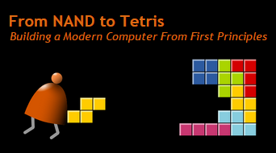

# Nand to Tetris
 

This repository contains my solutions to the projects in the *Nand to Tetris* course (parts I and II).  The files are organized according to the projects to which they belong. No built-in code, test scripts, or auxiliary files are included, because these can already be found on the [course's website](https://www.nand2tetris.org/) and may change in the future. The only exceptions are contained in the .zip files (one per project) which are my submissions to the Coursera grader and sometimes consist not of the source code needed to solve the projects, but of the result that they produce when run on some given test files.

## Link to and description of each project

### Part I
* [Project 1](https://github.com/pzuehlke/NAND2Tetris/tree/main/01): Build several single- and multi-bit elementary logic gates (such as NOT, AND, OR, XOR, multiplexers and demultiplexers) using the NAND gate as the only given primitive.
* [Project 2](https://github.com/pzuehlke/NAND2Tetris/tree/main/02): Implement a half-adder, a full-adder, a (16-bit) adder, a (16-bit) incrementer and a simple ALU (arithmetic logic unit).
* [Project 3](https://github.com/pzuehlke/NAND2Tetris/tree/main/03): Build chips that can store data using only DFFs (data flip-flops) as primitives gates. These include 1- and 16-bit registers, RAMs of several sizes (containing from 8 to 16K registers) and a program counter to be included in the CPU.
* [Project 4](https://github.com/pzuehlke/NAND2Tetris/tree/main/04): Write two simple programs in symbolic assembly language.
* [Project 5:](https://github.com/pzuehlke/NAND2Tetris/tree/main/05) Build a "computer" by putting together the CPU, a 16K RAM, memory maps for screen output and keyboard input and a ROM. The latter three are provided as primitives, but differ little from the RAMs built in Project 3.
* [Project 6](https://github.com/pzuehlke/NAND2Tetris/tree/main/06): Implement an assembler. I chose to do this in Java. The assembler automatically translates symbolic assembly language into binary code that the hardware built in Project 5 can understand and execute.

### Part II
* [Project7](https://github.com/pzuehlke/NAND2Tetris/tree/main/07) and [Project 8](https://github.com/pzuehlke/NAND2Tetris/tree/main/08): Implement a VM translator that converts VM code based on a stack into Hack assembly code. This was done using Java. My original solution to Project 8 passed all tests except the one for "FibonacciElement" due to a bug which took me a lot of time to find. It is easy to make a mistake in the assembly code when manipulating pointers.
* [Project 9](https://github.com/pzuehlke/NAND2Tetris/tree/main/09): ...
* [Project 10](https://github.com/pzuehlke/NAND2Tetris/tree/main/10): Implement a syntax analyzer for the Jack language, consisting of a tokenizer and a parser. For testing purposes it translates the source code into an XML document which model the tree-like structure of the code. This project requires a lot of grinding.
* [Project 11](https://github.com/pzuehlke/NAND2Tetris/tree/main/11): Implement the code generation part of the compiler, which uses the services of the syntax analyzer to translate Jack code to VM code.
* [Project 12](https://github.com/pzuehlke/NAND2Tetris/tree/main/12): Implement the OS through eight modules written in Jack, including memory management, input and output handling, and system bootstrap.

## Official resources
* The [official website of *Nand to Tetris*](https://www.nand2tetris.org/), and in particular the [online IDE](https://nand2tetris.github.io/web-ide/chip/), which is all that one needs to complete almost every project. I couldn't find the target .xml files for Project 10 inside the IDE, had to download them [from this link](https://drive.google.com/file/d/1xZzcMIUETv3u3sdpM_oTJSTetpVee3KZ/view). Also, as of the time of writing, the IDE doesn't seem to have the "TextComparer" tool implemented, so I just used `diff -w`.
* The [accompanying book](https://mitpress.mit.edu/9780262539807/the-elements-of-computing-systems/): Nisan, N. and Schocken, S. — *Elements of Computing Systems* (2nd ed., MIT Press).
* The Coursera course(s): [Part I](https://www.coursera.org/learn/build-a-computer) and [Part II](https://www.coursera.org/learn/nand2tetris2), containing the video lectures. These lectures follow the book pretty closely, with some extra comments sprinkled in and some tutorials on the utilities provided in the IDE. Like every other resource, they are very well made. However, they are definitely not necessary to complete the project. I preferred to use the book when actually doing the projects since it is much easier to find the various specifications there than it is to search for the right places in the videos.

## Additional links
* A [TED Talk](https://www.ted.com/talks/shimon_schocken_the_self_organizing_computer_course?subtitle=en) by Prof. Schocken about the *Nand to Tetris* course and an app co-developed by him called [*Matific*](https://www.matific.com), which teaches Math topics to children using the same learning-by-doing philosophy.
* An interesting [podcast episode](https://www.youtube.com/watch?v=4oPZaM47f3k) where he explains what motivated him to leave a tenured position at NYU to go back to Israel and help found Reichman University, how *Nand to Tetris* was planned and created, his views on learning and teaching and some other topics.

## Some personal comments
This course and the associated resources are a pedagogical masterpiece. One can only imagine the amount of work it must have taken to produce all of the course
material. More than any other MOOC I have taken, *Nand to Tetris* manages to transmit an incredible amount of knowledge and intuition per time/space. If you are at all interested in computers and have the necessary time, I strongly recommend you give it a try.  However, for Part II I you should be comfortable with some object-oriented programming. (The Coursera auto-grader currently only accepts Python or Java code, but the NAND2Tetris course itself is language-agnostic.) In Part I, only project 6 requires programming experience.